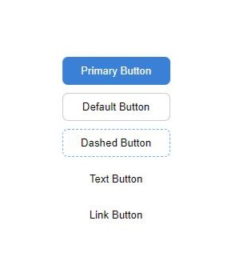

# nemfui

<p>
  This is a button component that you can use in your React projects. Depending on your needs, you can set the component's 
  'type' property to 'primary', 'default', 'dashed', 'text', or  'link'.
</p>


> Made with create-react-library

[](https://www.npmjs.com/package/nemfuiff) [](https://standardjs.com)

## Install

```bash
npm install nemfuiff
```

## Usage

```jsx
import { Button } from 'nemfuiff';
import 'nemfuiff/dist/index.css'

function App() {
  return (
    <div className="App">
      <Button type="primary" content="Primary Button"></Button>
      <Button type="default" content="Default Button"></Button>
      <Button type="dashed" content="Dashed Button"></Button>
      <Button type="text" content="Text Button"></Button>
      <Button type="link" content="Link Button"></Button>
    </div>
  );
}

export default App;
```
## SS
<div align="center">
 
</div>


## License

MIT © [barissonar](https://github.com/barissonar)
